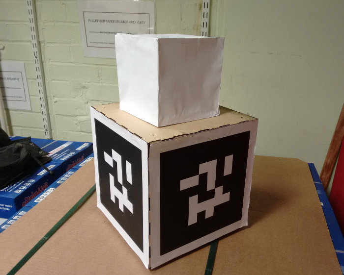
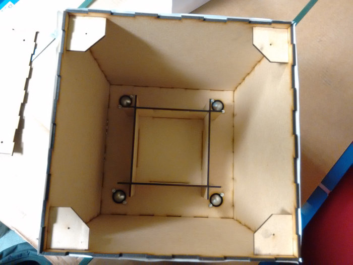
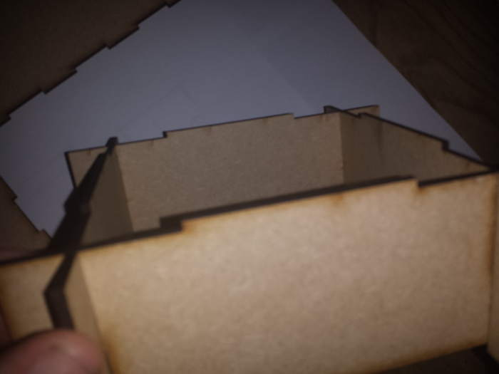
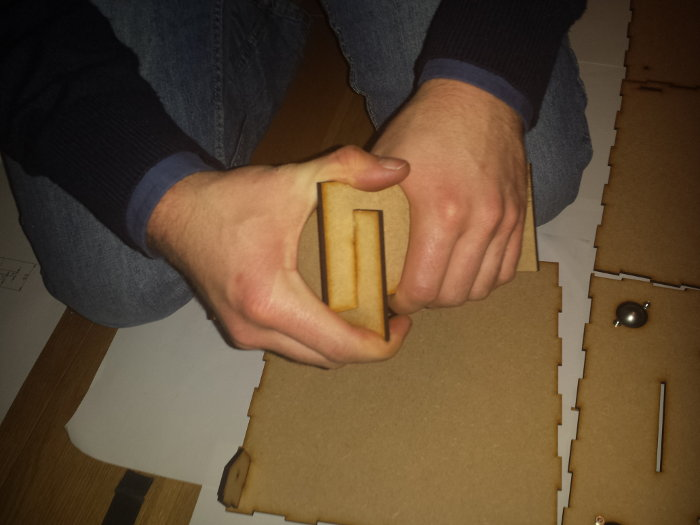
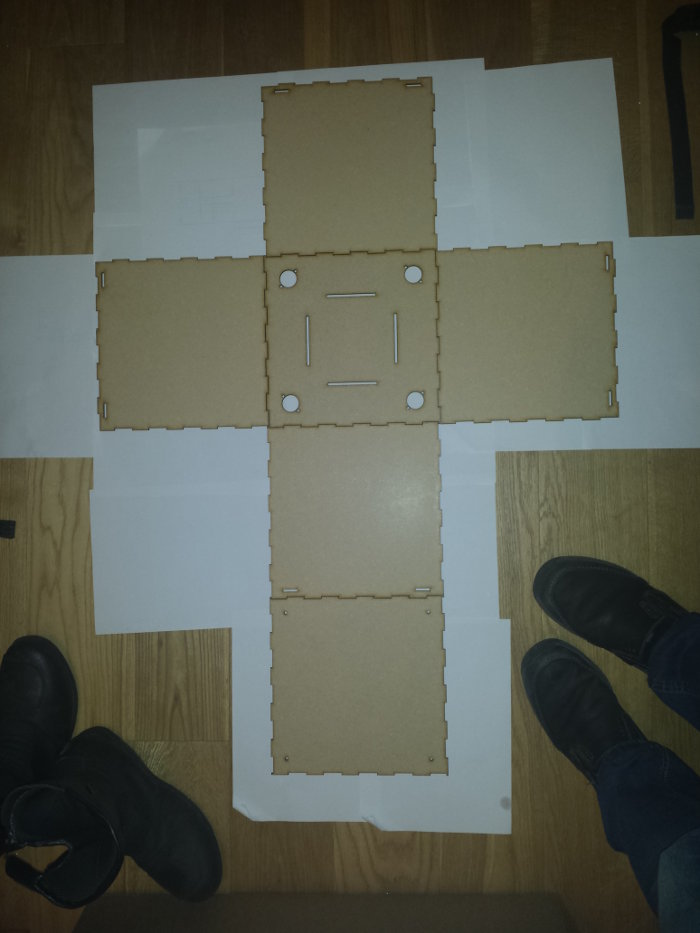
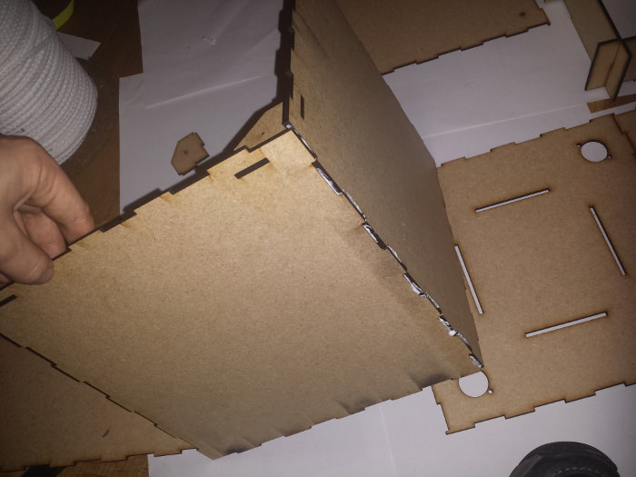
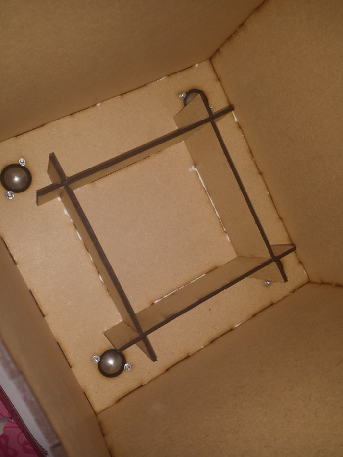
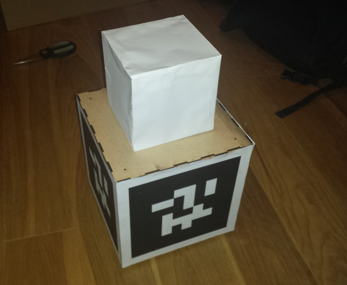

#2015 Flags

To test your robot for the 2015 competition, You're likely to want some flags for yourself. The flags are made of MDF, and are on casters. The mass of the flags will be 2±0.2kg, and the flags come with ballast holders to help you weigh them down.

## Bill of Materials

1. 3mm MDF to laser cut
**OR** a web browser to order the designs online.
2. The flag schematics (should be in the same zip as this document)
3. Wood Glue
	(recommended: PVA)
4. 4x 3mm wood screws
	(suggested length 16mm)
5. 4x The correct casters ([omnitrack LD16](http://www.omnitrack.co.uk/lightduty/saturn-type-ball-units-LD-m.php))
6. 8x 3mm nuts and screws for casters, ideally locknuts.
	(suggested M3 bolt 12mm [Farnell 1420391](http://uk.farnell.com/1420391))
	(suggested M3 nyloc nut [Farnell 1420431](http://uk.farnell.com/1420431))
7. Also a good idea to use washers
	(suggested [Farnell 1377496](http://uk.farnell.com/1377496))
8. Sand/Sugar/Something heavy to use as ballast. You'll need ~0.8kg of extra ballast, but weigh it yourself if you want to be certain.
(suggested [Wickes 220201](http://www.wickes.co.uk/Wickes-Block-Paving-Sand-Major-Bag/p/220201))

###DON'T FORGET

**The flags have undefined 'hats' on top. Don't design a robot to grab flags by the top face.**

##Cutting Instructions:

*(For if you're using your own laser cutter)*

* Make sure you have 3mm material.
* MDF is suggested as the material to cut, as it will be what the actual flags are made of.
* If your laser cutter is large enough to cut 790mmx380mm designs, you can simply cut the files in the /790x380/ folder. the files to cut are dxf files are a typical CAD file and can be opened in most 2D editors (including Inkscape and Adobe Illustrator)
* Otherwise, there are smaller files in the /600x400/ directory, you need to cut 1 x *600mmx400mm_A.dxf* and 2 x *600mmx400mm_B_x2.dxf* to make 1 flag.

If you would like access to the raw design files, they are available on the git repository at [https://www.studentrobotics.org/cgit/arena.git/tree/comp15/flags](https://www.studentrobotics.org/cgit/arena.git/tree/comp15/flags)

## Razorlab Cutting Instructions:

*(For if you don't have access to a laser cutter)*

If you don't have access to a laser cutter, you can order designs to be cut online. For this, we suggest you use[Razorlab](http://www.razorlab.co.uk/make-a-product/).
1.  Create an account in [Razorlab.co.uk](http://www.razorlab.co.uk/make-a-product/)
2. Upload the 2 files in the /razorlab/ folder; namely:
	- *sr2015_flag_razorlab_panel1_reva.eps*, and
	- *sr2015_flag_razorlab_panel2_reva.eps*
3. Choose 3mm MDF as the material.
4. The price should total just shy of £28.
4. Pay, and receive the design in the post in a few working days.

## Assembly Instructions (with pictures):

You're aiming for this:

### Ballast Box assembly:

The Flags come with ballast boxes in the centre, designed for you to fill with ~0.8kg of 'ballast' (sand, sugar, anything as long as it's heavy enough). The boxes are to prevent the ballast from shifting around as it is moved by the robots. Here's how you assemble them.

The sides are rectangles with slots that make them look S shaped. At first sight they seem impossible to assemble, but I assure you it's possible;

Slot in 3 of the 4 corners, making sure the long tabs are all on the correct side:

After you have 3 of the 4 corners, slide the last corner sideways and then into the slot. It's a tight fit, so be careful.

### Side Assembly:

The bottom is the large piece with the most holes. The top is the piece with the 4 holes cut out, and the corner pieces are to hold the top together. Too confusing, here's a photo of them laid out correctly:

**Don't put the casters on before you've assembled the sides**, otherwise it will slide around while you're trying to put the sides on.

**Don't glue the top on!** it should be attached by screws, so you can get at the casters.

Otherwise, you can assemble the rest in any order you please,
We prefer to glue a ring with the sides, adding the top and bottom last, as you only need to glue 1 edge at a time.

### Caster Assembly:

You should have 4 casters, 8 nuts,  8 washers, and 8 bolts.

Slot the casters in the bottom, and tighten on the nuts. No need to be too tight;
 You may even get away with it being finger tight.

### Adding Ballast:

Weigh out ~0.8kg of the material you'll be using for ballast (paving sand is suggested if you don't already have something suitable). Pour your ballast into the ballast container. The markers should be 2kg ± 0.2kg.

We can't guarantee nothing will leak out, so be sure you've applied plenty of glue, or keep the ballast in a bag.

You can glue the ballast container lid down if you don't want to change it later on. (this is what the square is in the designs)

### Attaching the markers
Firstly, Print off the markers, as they're 25cmx25cm, they should be printed off on A3. They're available [on the docs](https://www.studentrobotics.org/docs/programming/sr/vision/markers) After that, simply cut them out and stick them on the sides of your flag. 

* Make sure they're all the same number
* Make sure they're all the correct way up (there's text on the bottom left, and a small circle in the top right to help you with orientation)

### Assembling the lid
The lid simply sits on the top of the flag, and is then screwed in with the wood screws mentioned in the Bill of Materials. Don't screw them too tight, as they could strip the wood underneath.
Don't forget they have a hat!! you can make an origami hat to remind yourselves, like we have here:

*... and then you've finished! one fully functional flag.*
